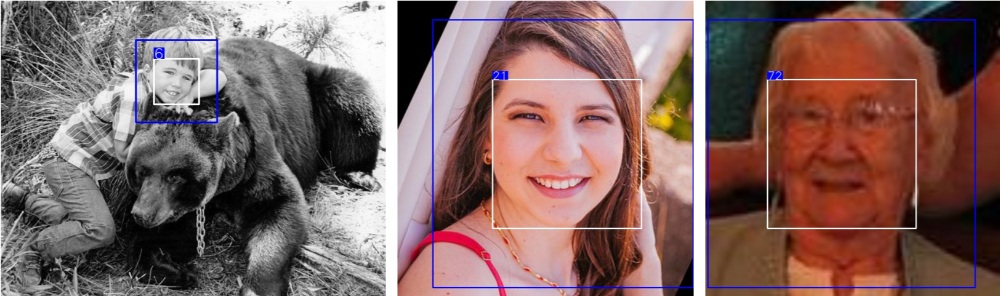
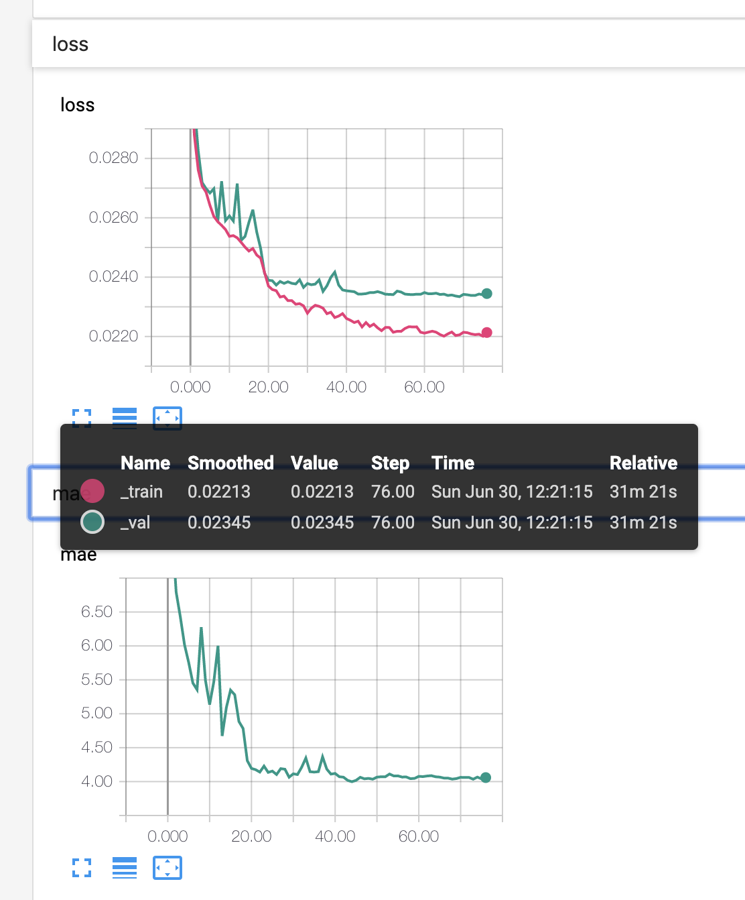

# Age Estimation PyTorch
PyTorch-based CNN implementation for estimating age from face images.
Currently only the APPA-REAL dataset is supported.
Similar Keras-based project can be found [here](https://github.com/yu4u/age-gender-estimation).



## Requirements

```bash
pip install -r requirements.txt
```

## Demo
Webcam is required.
See `python demo.py -h` for detailed options.

```bash
python demo.py
```

Using `--img_dir` argument, images in that directory will be used as input:

```bash
python demo.py --img_dir [PATH/TO/IMAGE_DIRECTORY]
```

Further using `--output_dir` argument,
resulting images will be saved in that directory (no resulting image window is displayed in this case):

```bash
python demo.py --img_dir [PATH/TO/IMAGE_DIRECTORY] --output_dir [PATH/TO/OUTPUT_DIRECTORY]
```

## Train

#### Download Dataset

Download and extract the [APPA-REAL dataset](http://chalearnlap.cvc.uab.es/dataset/26/description/).

> The APPA-REAL database contains 7,591 images with associated real and apparent age labels. The total number of apparent votes is around 250,000. On average we have around 38 votes per each image and this makes the average apparent age very stable (0.3 standard error of the mean).

```bash
wget http://158.109.8.102/AppaRealAge/appa-real-release.zip
unzip appa-real-release.zip
```

#### Train Model
Train a model using the APPA-REAL dataset.
See `python train.py -h` for detailed options.

```bash
python train.py --data_dir [PATH/TO/appa-real-release] --tensorboard tf_log
```

Check training progress:

```bash
tensorboard --logdir=tf_log
```



#### Training Options
You can change training parameters including model architecture using additional arguments like this:

```bash
python train.py --data_dir [PATH/TO/appa-real-release] --tensorboard tf_log MODEL.ARCH se_resnet50 TRAIN.OPT sgd TRAIN.LR 0.1
```

All default parameters defined in [defaults.py](defaults.py) can be changed using this style.


#### Test Trained Model
Evaluate the trained model using the APPA-REAL test dataset.

```bash
python test.py --data_dir [PATH/TO/appa-real-release] --resume [PATH/TO/BEST_MODEL.pth]
```

After evaluation, you can see something like this:

```bash
100%|███████████████████████████████████████████████████████████████████████████████████████████████████████████████████████████| 16/16 [00:08<00:00,  1.28it/s]
test mae: 4.800
```
